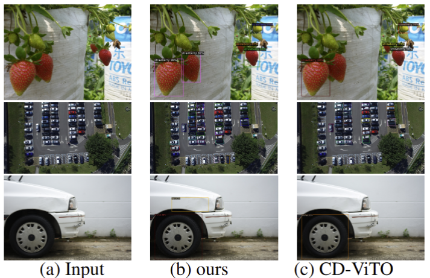

# 🥇 NTIRE 2025 CD-FSOD Challenge @ CVPR Workshop

We are the **award-winning team** of the **NTIRE 2025 Cross-Domain Few-Shot Object Detection (CD-FSOD) Challenge** at the **CVPR Workshop**.

- 🏆 **Track**: `xx-source track`
- 🎖️ **Award**: **1st Place**

🔗 [NTIRE 2025 Official Website](https://cvlai.net/ntire/2025/)  
🔗 [NTIRE 2025 Challenge Website](https://codalab.lisn.upsaclay.fr/competitions/21851)  
🔗 [CD-FSOD Challenge Repository](https://github.com/lovelyqian/NTIRE2025_CDFSOD)


---

## 🧠 Overview

This repository contains our solution for the `xx-source track` of the NTIRE 2025 CD-FSOD Challenge.  We propose a method that integrates **Instance-Feature-Caching to provide few-shot knowledge support and dynamically optimize detection performance**, which achieves strong performance on the challenge. 

---

## 🛠️ Environment Setup

An anaconda environment is suggested, take the name "cdfsod" as an example:

```
git clone git@github.com:lovelyqian/CDFSOD-benchmark.git
conda create -n cdfsod python=3.9
conda activate cdfsod
pip install -r CDFSOD-benchmark/requirements.txt 
pip install -e ./CDFSOD-benchmark
cd CDFSOD-benchmark
```

## 📂 Dataset Preparation

Please follow the instructions in the [official CD-FSOD repo](https://github.com/lovelyqian/NTIRE2025_CDFSOD) to download and prepare the dataset.

## 🏋️ Training

To train the model: 

1. download weights: download pretrained model from [DE-ViT](https://github.com/mlzxy/devit/blob/main/Downloads.md).
2. download datasets：dataset1、dataset2、dataset3 . Put them in ./CDFSOD-benchmark/datasets/
3. run script:

```
bash main_results.sh
```

pretrained model: [Google Drive](https://drive.google.com/file/d/1KfNnkM7SewMN6nroRSG-GNiuaEELx6EP/view?usp=drive_link)

## 🔍 Inference & Evaluation

Run inference:

#### Evaluation



In our implementation, we utilize a server running Ubuntu20.04 equipped with a single RTX A800 GPU. The model is pre-trained on COCO and fine-tuned on novel support images. The specific hyper-parameter settings can be found in our paper.

 The results for 1/5/10 shot scenarios on three novel target datasets are summarized in table.

|         | Method     | Setting      | Dataset1 | Dataset2 | Dataset3 |
| ------- | ---------- | ------------ | -------- | -------- | -------- |
| 1-shot  | CD-ViTO    | Close-Source | 27.95    | 6.77     | 10.07    |
| 1-shot  | our method | Close-Source | 36.58    | 23.01    | 20.11    |
| 5-shot  | CD-ViTO    | Close-Source | 37.42    | 21.28    | 26.47    |
| 5-shot  | our method | Close-Source | 46.95    | 29.68    | 29.68    |
| 10-shot | CD-ViTO    | Close-Source | 43.58    | 24.00    | 30.00    |
| 10-shot | our method | Close-Source | 50.98    | 28.00    | 33.00    |

From this table, we can see that our method has achieved significant improvement compared to the baseline.

## 📄 Citation

If you use our method or codes in your research, please cite:

```
@inproceedings{fu2025ntire, 
  title={NTIRE 2025 challenge on cross-domain few-shot object detection: methods and results,
  author={Fu, Yuqian and Qiu, Xingyu and Ren, Bin and Fu, Yanwei and Timofte, Radu and Sebe, Nicu and Yang, Ming-Hsuan and Van Gool, Luc and others},
  booktitle={CVPRW},
  year={2025}
}
```


